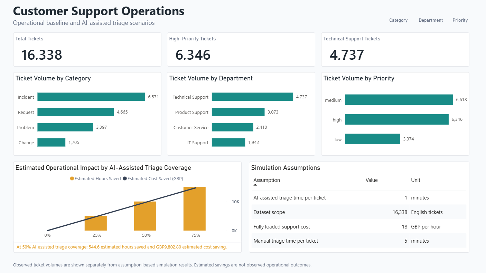
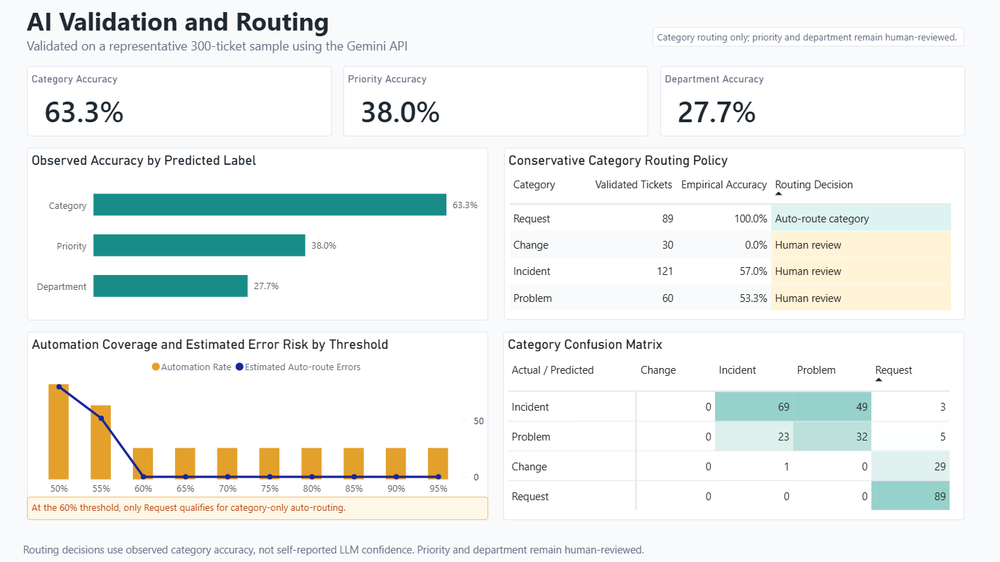
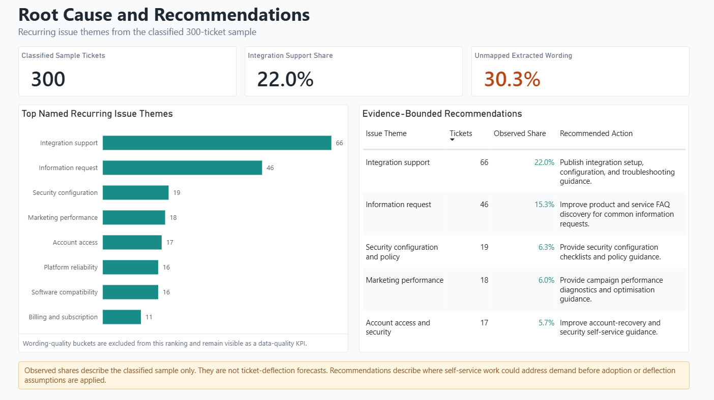

# AI-Augmented Customer Support Operations Analytics

An operations analytics project that evaluates where AI-assisted customer-support triage can be used safely, where human review must remain, and which recurring issue themes offer the clearest self-service opportunities.

## Executive Summary

Using a synthetic but realistic multilingual customer-support dataset, this project cleaned 28,587 source tickets into 16,338 English tickets, then validated Gemini API classifications against known operational labels on a representative 300-ticket sample.

The result is deliberately conservative: category prediction was useful enough for a limited category-only routing policy, while priority and department prediction were not reliable enough for automation. The dashboard keeps observed results, simulation assumptions, and root-cause caveats separate.

## Dashboard

### Page 1: Operational Baseline



### Page 2: AI Validation and Routing



### Page 3: Root Cause and Recommendations



## Key Findings

- **Operational baseline:** 16,338 cleaned English tickets; 6,346 were high priority and Technical Support was the largest queue with 4,737 tickets.
- **Validated AI performance:** category accuracy was **63.3%**, compared with **38.0%** for priority and **27.7%** for department.
- **Conservative routing policy:** at a 60% empirical-accuracy threshold, only the **Request** category qualified for category-only auto-routing. It represented 89 of 300 validated tickets and had 100.0% observed category accuracy in this sample. Priority and department remain human-reviewed.
- **Illustrative efficiency scenario:** at 50% AI-assisted triage coverage, the stated handling-time assumptions indicate **544.6 hours** and **GBP 9,802.80** in potential savings across the cleaned English dataset. These are simulation estimates, not observed savings.
- **Recurring issue themes:** Integration support was the largest named theme at **22.0%** of the classified sample, followed by Information request at **15.3%**.

## Root-Cause Mapping Quality

LLM-extracted root causes were converted to named themes using deterministic keyword rules. Of 300 classified tickets, 209 (69.7%) were assigned to a named theme. The remaining 91 tickets (30.3%) are retained as `Other extracted issue` rather than forced into an unsuitable category.

This is an intentional data-quality guardrail: named themes inform exploratory self-service opportunities, while the unmapped share makes the taxonomy limitation visible. See the [root-cause mapping audit](reports/ROOT_CAUSE_MAPPING_AUDIT.md).

## Methodology

1. Cleaned the Kaggle source data, removed duplicates, and filtered to English tickets.
2. Performed EDA on ticket category, department, and priority distributions.
3. Drew a stratified 500-ticket sample; 300 successful Gemini API classifications were available for validation.
4. Constrained Gemini category, priority, and department predictions to the observed operating taxonomy.
5. Calculated accuracy, precision, recall, F1, confusion matrices, and category-level empirical accuracy.
6. Designed routing policy from empirical accuracy, not self-reported LLM confidence.
7. Extracted root-cause wording, grouped it into transparent issue themes, and limited recommendations to observed sample shares.

## Data and Scope

- **Dataset:** [Multilingual Customer Support Tickets](https://www.kaggle.com/datasets/tobiasbueck/multilingual-customer-support-tickets)
- **Data type:** synthetic but realistic customer-support tickets used for demonstration purposes
- **Source rows:** 28,587
- **Cleaned English tickets:** 16,338
- **Validated AI sample:** 300 successful classifications from a 500-ticket stratified sample
- **AI provider:** Gemini API, using the Free Tier only

The methodology and metrics are transferable to real production ticket data, but the numerical results in this repository should not be interpreted as production performance.

## Repository Guide

| Location | Contents |
| --- | --- |
| `notebooks/` | Reproducible EDA and validation notebooks. |
| `src/` | Cleaning, Gemini classification, validation, routing, and export modules. |
| `sql/` | Optional EDA validation queries. |
| `dashboard/powerbi/` | Final dashboard screenshots, DAX measures, and Power BI build guides. |
| `reports/` | Methodology and root-cause mapping audit. |

For Power BI implementation detail, see the [dashboard build guide](dashboard/powerbi/README.md) and the [Korean step-by-step guide](dashboard/powerbi/POWER_BI_STEP_BY_STEP_KO.md).

## Reproduce Locally

1. Place the Kaggle CSV in `data/raw/`.
2. Install dependencies with `pip install -r requirements.txt`.
3. Clean and sample the dataset:

```bash
python -m src.run_pipeline --raw-file data/raw/your_file.csv --sample-size 500
```

4. Set `GEMINI_API_KEY` and `GEMINI_FREE_TIER_ONLY=true` in a local `.env` file. Do not commit the file.
5. Run the classifier and then regenerate metrics and dashboard tables:

```bash
python -m src.gemini_classification --input data/processed/classification_sample.csv
python -m src.run_pipeline --evaluate-only
```

## Status

| Phase | Status | Outcome |
| --- | --- | --- |
| Phase 1: Core Analytics | Complete | Cleaning, EDA, validation metrics, confusion matrices, and assumption-based efficiency scenarios. |
| Phase 2: AI Routing Design | Complete | Empirical-accuracy routing policy and threshold trade-off analysis. |
| Phase 3: Root Cause and Recommendations | Complete with caveat | Named-theme recommendations plus visible 30.3% unmapped-wording quality guardrail. |

## Important Limitations

- LLM confidence is supplementary only; it does not determine routing decisions.
- Savings are assumption-based scenarios, not measured production outcomes.
- Root-cause themes are exploratory groupings of LLM-extracted wording, not independently verified production root causes.
- Raw data, generated output tables, `.env`, and `.pbix` files are intentionally excluded from GitHub.
